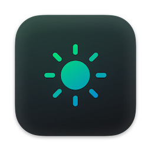
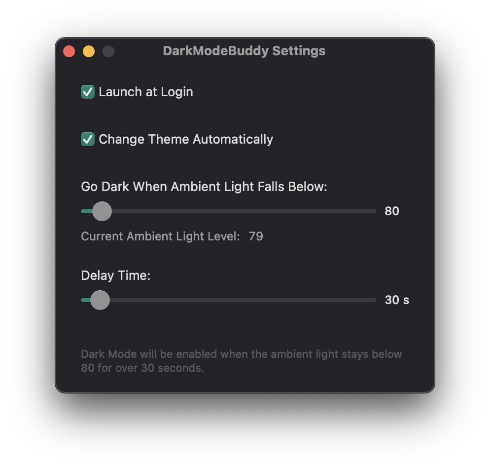

# DarkModeBuddy

Automatically switch your Mac between light and dark modes based on the ambient light sensor.

I've never been a fan of the built-in "Auto" mode on macOS because it's based on time of day and it will not switch the Mac to Dark Mode while I'm actively using it (which is a problem, since I'm pretty much always using my Mac).

The solution for that is DarkModeBuddy. It's a tiny app that keeps running in the background and reads the ambient light sensor on your Mac (the same one it uses to adjust the brightness of your screen). When the ambient light level falls below the configured value, DarkModeBuddy automatically switches the Mac into Dark Mode. When the ambient light level rises above the configured value, it goes back into Light mode. This does not happen instantaneously: in order to prevent flickering, the change in ambient light level must persist for a certain amount of time, which can also be configured in the app's settings.

# Compatibility

**DarkModeBuddy requires macOS Catalina or later and a Mac with a built-in ambient light sensor. External displays with ambient light sensors are not currently supported.**

Below is a non-exhaustive list of Mac models that have been verified to work with DarkModeBuddy. If your Mac is newer than any of the models on the list, it is likely to be supported as well.

- MacBook Air (M1, 2020)
- MacBook Pro (M1, 2020)
- iMac (Retina 5K, 27-inch, 2020)
- MacBook Pro 16" (2019)
- MacBook Pro 13" (2019)
- MacBook Pro 13" (2018)
- MacBook Pro (Retina, 15-inch, Mid 2015)
- MacBook Pro (Retina, 15-inch, Mid 2014)

Pull requests adding support to hardware that's not currently supported are more than welcome.

# Download

DarkModeBuddy is available for free (it's also open-source). If you prefer, you can pay any amount you'd like in order to support my work.

[You can always get the latest build on Gumroad](https://darkmodebuddy.app).